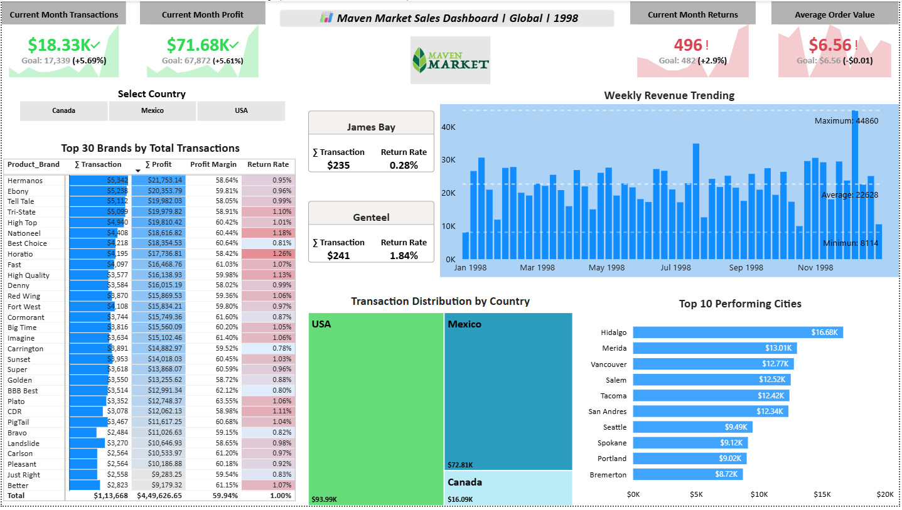
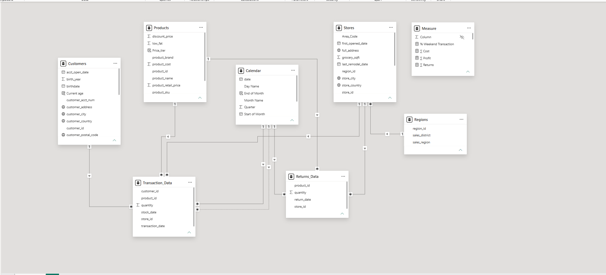
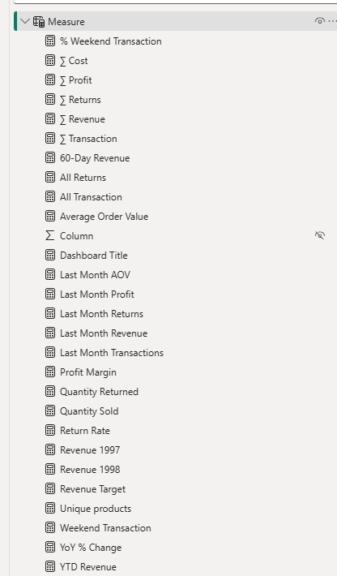
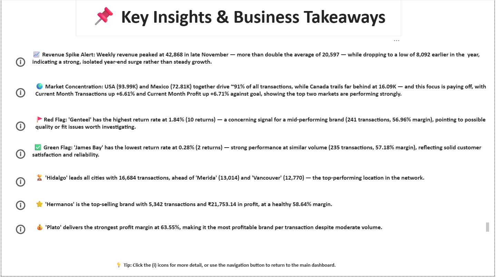

<div align="center">

# 🛒 Maven Market — Retail Sales Analytics Dashboard

**An end-to-end Power BI project** covering data modeling, DAX, and interactive dashboard design for a multi-national grocery retailer.



</div>

---

## 📌 Overview

**Maven Market** is a multi-national grocery chain operating stores across the **USA, Mexico, and Canada**. This project builds a self-service Power BI report analyzing **1998 sales, profitability, and returns performance**, giving stakeholders the ability to drill into results by country, city, and product brand — with month-over-month goal tracking built in.

**Business questions this dashboard answers:**
- Are we hitting our monthly transaction, profit, and return targets?
- Which markets and cities are driving the most volume?
- Which product brands are most profitable — and which have return-rate red flags?
- How does revenue trend week to week, and where are the seasonal spikes?

## 🛠️ Skills Demonstrated

| Area | What was done |
|---|---|
| **Power Query / ETL** | Connected 7 source files, cleaned and typed columns, merged/split fields, handled nulls, built conditional columns |
| **Data Modeling** | Designed a star schema (snowflaked on Regions) with clean one-directional filter flow between fact and dimension tables |
| **DAX** | Built 20+ measures covering KPIs, time intelligence, rolling totals, and goal-tracking logic |
| **Report Design** | KPI cards, conditional-formatted matrix, map, treemap, bookmarks, and drillthrough interactivity |

## 🗂️ Data Model

Seven tables in a star schema — `Stores` extends into `Regions` as a snowflake. Both fact tables (`Transaction_Data`, `Returns_Data`) connect only through shared dimension tables (`Customers`, `Products`, `Stores`, `Calendar`), never directly to each other, keeping filter context clean and one-directional.

<div align="center">



</div>

| Table | Type | Description |
|---|---|---|
| `Transaction_Data` | Fact | 269,720 sales transactions (1997–1998) |
| `Returns_Data` | Fact | 7,087 product returns |
| `Customers` | Dimension | Customer demographics and loyalty tier |
| `Products` | Dimension | 1,560 products across 111 brands |
| `Stores` | Dimension | Store locations and attributes |
| `Regions` | Dimension | Sales regions/districts (snowflaked off Stores) |
| `Calendar` | Dimension | Date table powering all time intelligence |

## 📐 Key DAX Measures

<div align="center">



</div>

**Core KPIs**
```dax
Total Revenue, Total Cost, Total Profit, Profit Margin
Total Transactions, Total Returns, Return Rate
```

**Time Intelligence**
```dax
YTD Revenue, 60-Day Revenue (rolling window)
Last Month Revenue, Last Month Profit, Last Month Transactions, Last Month Returns
Revenue Target (5% lift over prior month — used as the goal benchmark on KPI cards)
```

**Behavioral / Segment Measures**
```dax
Weekend Transactions, % Weekend Transaction
Unique Products, Average Order Value
```

## 📊 Dashboard Pages

### Page 1 — Topline Performance *(filtered to 1998)*
- KPI cards for Transactions, Profit, Returns, and AOV — each with a trend sparkline and goal comparison
- Top 30 Brands matrix: transactions, profit, profit margin, and return rate, with conditional-formatted data bars and color scales
- Weekly revenue trend chart
- Transaction distribution by country (treemap)
- Top 10 performing cities

<div align="center">


</div>

### Page 2 — Key Insights & Business Takeaways
A written narrative layer translating the numbers into plain-language business takeaways — seasonality, market concentration, and brand-level performance flags.

<div align="center">



</div>

## 💡 Highlighted Insights *(1998)*

- 📈 **Year-end revenue surge** — weekly revenue peaked at ~43K in late November, more than double the yearly average of ~20.6K, pointing to a seasonal spike rather than steady growth.
- 🌎 **Market concentration** — USA and Mexico together drive ~91% of all transactions, with Canada trailing well behind — yet both leading markets are still beating their current-month goals.
- 🚩 **Brand-level red flag** — one mid-performing brand shows a notably higher return rate than peers at similar volume, worth investigating for quality or fit issues.
- ✅ **Brand-level green flag** — another brand at similar transaction volume has one of the lowest return rates in the dataset, a reliability benchmark.
- 🏆 **Top location** — one city leads the entire store network in total transactions, meaningfully ahead of the next closest.

*(Full breakdown with exact figures available on the "Key Insights & Business Takeaways" page of the report.)*

## 📁 Repository Structure

```
maven-market-retail-sales-analysis/
├── MavenMarket_Report.pbix   → Full Power BI report
├── data/                     → Source CSV files
├── screenshots/              → Dashboard and data model images
└── README.md
```

## 🚀 How to Use

1. Clone or download this repo
2. Open `MavenMarket_Report.pbix` in Power BI Desktop
3. Refresh data if needed (source files included in `/data`)
4. Explore — use the country slicer, drill into the treemap, or click through the bookmark buttons on the Notes page

---

<div align="center">

*Dataset: Maven Market sample dataset (Maven Analytics), used for portfolio/practice purposes.*

</div>
